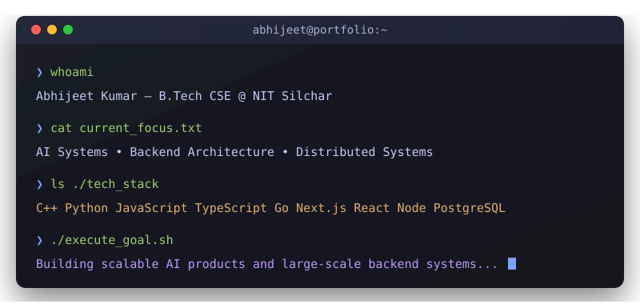

<div align="center">
  
  
  <br/>
  <i><b>"Building scalable AI systems and backend applications."</b></i>
  <br/><br/>
  
  <a href="https://abhijeet-portfolio-teal.vercel.app/"></a>
  <a href="https://www.linkedin.com/in/abhijeet-kumar-2a280b2a3"></a>
  <a href="#"></a>
  <a href="mailto:your.email@example.com"></a>
  
  <br/><br/>
  <code>System Status: Online & Open to exciting opportunities</code>
</div>

<br/>

<h2 align="center">✦ WHOAMI ✦</h2>

<div align="center">
  
</div>

<br/>

<!-- <h2 align="center">✦ ABHIJEET OS ✦</h2>

```text
┌──────────────────────────────────────────────────────────────────┐
│ AbhijeetOS v3.0                                                  │
├──────────────────────────────────────────────────────────────────┤
│ Status     : Building AI Recruitment System & Music Hub          │
│ Role       : Full Stack Developer & AI Engineer                  │
│ Rank       : Codeforces Pupil                                    │
│ Education  : B.Tech CSE @ NIT Silchar                            │
└──────────────────────────────────────────────────────────────────┘
```

<br/> -->

<h2 align="center">✦ FEATURED PROJECTS ✦</h2>

<table align="center" width="100%">
  <tr>
    <td width="50%" valign="top">
      <h3>🤖 AI Autonomous Recruitment System</h3>
      <p>A multimodal AI interview platform leveraging Gemini/Groq models for end-to-end recruitment.</p>
      <code>★ 95%+ Resume Parsing Accuracy</code><br/>
      <code>★ Supports 500+ Concurrent Users</code><br/>
      <code>★ Voice Interviews & AI Evaluation</code>
    </td>
    <td width="50%" valign="top">
      <h3>🎵 Music Hub</h3>
      <p>A high-performance Spotify-inspired music streaming platform built for scalability.</p>
      <code>★ Seamless Music Streaming</code><br/>
      <code>★ Advanced Playlist Management</code><br/>
      <code>★ Robust API Integration & Backend</code>
    </td>
  </tr>
  <tr>
    <td colspan="2" align="center" valign="top">
      <br/>
      <h3>✨ Portfolio Website</h3>
      <p>Modern portfolio featuring dynamic lighting effects, interactive design, and premium animations.</p>
    </td>
  </tr>
</table>

<br/>

<h2 align="center">✦ TECH STACK ✦</h2>

<div align="center">
  <p><b>Languages</b></p>
  <a href="https://skillicons.dev">
    
  </a>
  <br/>
  
  <p><b>Frontend</b></p>
  <a href="https://skillicons.dev">
    
  </a>
  <br/>

  <p><b>Backend & Databases</b></p>
  <a href="https://skillicons.dev">
    
  </a>
  <br/>

  <p><b>Tools</b></p>
  <a href="https://skillicons.dev">
    
  </a>
</div>

<br/>

<h2 align="center">✦ ACHIEVEMENTS ✦</h2>

<table align="center" width="100%">
  <tr align="center">
    <td width="33%">
      <h2>800+</h2>
      <code>DSA PROBLEMS SOLVED</code>
    </td>
    <td width="33%">
      <h2>PUPIL</h2>
      <code>CODEFORCES RANK</code>
    </td>
    <td width="33%">
      <h2>500+</h2>
      <code>CONCURRENT USERS</code>
    </td>
  </tr>
  <tr align="center">
    <td>
      <br/>
      <h2>95%+</h2>
      <code>PARSING ACCURACY</code>
    </td>
    <td>
      <br/>
      <h2>150+</h2>
      <code>VOLUNTEERS MANAGED</code>
    </td>
    <td>
      <br/>
      <h2>NIT SILCHAR</h2>
      <code>B.TECH CSE</code>
    </td>
  </tr>
</table>

<br/>

<h2 align="center">✦ GITHUB METRICS ✦</h2>

<div align="center">
  
  
  <br/><br/>
  
</div>

<br/>

<h2 align="center">✦ CONTRIBUTION GRAPH ✦</h2>

<div align="center">
  <picture>
    <source media="(prefers-color-scheme: dark)" srcset="https://raw.githubusercontent.com/Abhijeet-kumar-04/Abhijeet-kumar-04/output/github-contribution-grid-snake-dark.svg">
    <source media="(prefers-color-scheme: light)" srcset="https://raw.githubusercontent.com/Abhijeet-kumar-04/Abhijeet-kumar-04/output/github-contribution-grid-snake.svg">
    
  </picture>
</div>

<br/>

<h2 align="center">✦ KNOWLEDGE TREE ✦</h2>

```text
Computer Science
│
├── Competitive Programming
│     └── 800+ Problems Solved
│
├── Full Stack Development
│     ├── React & Next.js
│     ├── Node.js & Go
│     └── MongoDB & PostgreSQL
│
└── AI Engineering
      ├── Gemini & Groq Models
      ├── LLM Applications
      └── High Concurrency Systems
```

<br/>

<div align="center">
  
</div>

<br/>
<h2 align="center">✦ NOW ✦</h2>

<div align="center">
  <b>Building:</b> AI-Driven Applications & Scalable Backends<br/>
  <b>Learning:</b> Advanced System Design & Golang<br/>
  <b>Goal:</b> Distributed Systems Engineer<br/>
  <br/>
  <i>"I enjoy building scalable systems, solving algorithmic problems, and exploring AI-driven applications."</i>
</div>

<br/>

<div align="center">
  
</div>
