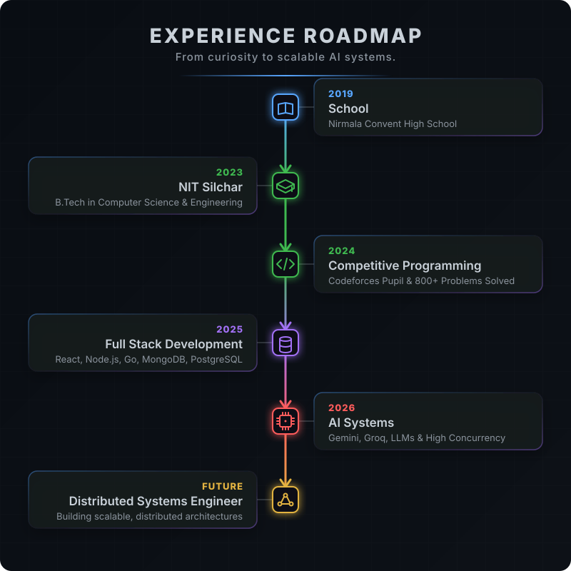

 

  
  
   
  <i><b>"Building scalable AI systems and backend applications."</b></i>
    
  
  
  
  

 
<h2 align="center">✦ FEATURED PROJECTS ✦</h2>

<table align="center" width="100%">
  <tr>
    <td width="50%" valign="top">
      <h3>🤖 AI Autonomous Recruitment System</h3>
      
A multimodal AI interview platform leveraging Gemini/Groq models for end-to-end recruitment.

      <code>★ 95%+ Resume Parsing Accuracy</code> 
      <code>★ Supports 500+ Concurrent Users</code> 
      <code>★ Voice Interviews & AI Evaluation</code>
    </td>
    <td width="50%" valign="top">
      <h3>🎵 Music Hub</h3>
      
A high-performance Spotify-inspired music streaming platform built for scalability.

      <code>★ Seamless Music Streaming</code> 
      <code>★ Advanced Playlist Management</code> 
      <code>★ Robust API Integration & Backend</code>
    </td>
  </tr>
  <tr>
    <td colspan="2" align="center" valign="top">
       
      <h3>✨ Portfolio Website</h3>
      
Modern portfolio featuring dynamic lighting effects, interactive design, and premium animations.

    </td>
  </tr>
</table>

 

<h2 align="center">✦ TECH STACK ✦</h2>

  
<b>Languages</b>

  
   
  
  
<b>Frontend</b>

  
   

  
<b>Backend & Databases</b>

  
   

  
<b>Tools</b>

  

 

<h2 align="center">✦ ACHIEVEMENTS ✦</h2>

<table align="center" width="100%">
  <tr align="center">
    <td width="33%">
      <h2>800+</h2>
      <code>DSA PROBLEMS SOLVED</code>
    </td>
    <td width="33%">
      <h2>PUPIL</h2>
      <code>CODEFORCES RANK</code>
    </td>
    <td width="33%">
      <h2>500+</h2>
      <code>CONCURRENT USERS</code>
    </td>
  </tr>
  <tr align="center">
    <td>
       
      <h2>95%+</h2>
      <code>PARSING ACCURACY</code>
    </td>
    <td>
       
      <h2>150+</h2>
      <code>VOLUNTEERS MANAGED</code>
    </td>
    <td>
       
      <h2>NIT SILCHAR</h2>
      <code>B.TECH CSE</code>
    </td>
  </tr>
</table>

 

<h2 align="center">✦ GITHUB & CODING METRICS ✦</h2>

  <!-- GitHub Stats and Top Languages in a Table for Perfect Alignment -->
  <table align="center" style="border: none; background-color: transparent;">
    <tr style="border: none; background-color: transparent;">
      <td align="center" style="border: none; background-color: transparent;">
        
      </td>
      <td align="center" style="border: none; background-color: transparent;">
        
      </td>
    </tr>
  </table>

<!-- GitHub Streak -->
  
    

<!-- Animated Divider -->
  
    

  <h2>🏆 Coding Profiles & Growth Tracking</h2>
  
<i>View my monthly effort recaps and competitive programming profiles:</i>

   

  <!-- Row 1: Primary Profiles -->
  
  &nbsp;
  
  &nbsp;
  
  &nbsp;
  
    

  <!-- Row 2: Competitive Programming -->
  
  &nbsp;
  
  &nbsp;
  
    

  <!-- Row 3: Practice & Problem Solving -->
  
  &nbsp;
  
  &nbsp;
  
  &nbsp;
  

 
   

 
<h2 align="center">✦ CONTRIBUTION GRAPH ✦</h2>

  <picture>
    <source media="(prefers-color-scheme: dark)" srcset="https://raw.githubusercontent.com/Abhijeet-kumar-04/Abhijeet-kumar-04/output/github-contribution-grid-snake-dark.svg">
    <source media="(prefers-color-scheme: light)" srcset="https://raw.githubusercontent.com/Abhijeet-kumar-04/Abhijeet-kumar-04/output/github-contribution-grid-snake.svg">
    
  </picture>

 

  

 
<h2 align="center">✦ NOW ✦</h2>

  <b>Building:</b> AI-Driven Applications & Scalable Backends 
  <b>Learning:</b> Advanced System Design & Golang 
  <b>Goal:</b> Distributed Systems Engineer 
   
  <i>"I enjoy building scalable systems, solving algorithmic problems, and exploring AI-driven applications."</i>

 

  

